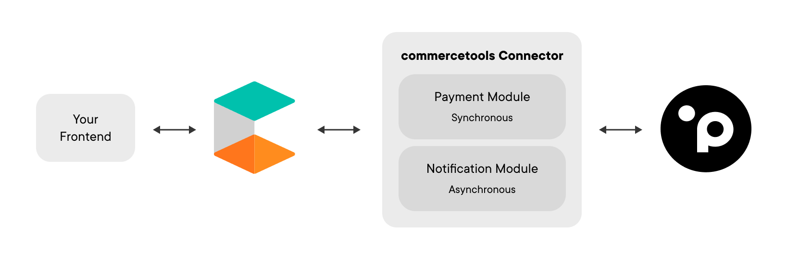
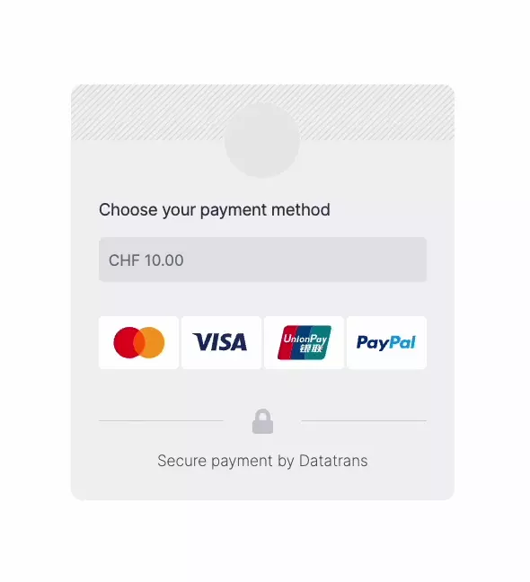

# Commercetools Connector for Planet (Datatrans)

  

Need a modern approach for online payments? Look no further. With our connector, your commercetools' projects will get instant access to dozens of payment methods, acquirers and currencies and will offer your customers a state-of-the-art user experience for online payments.

Planet is a multi-national financial services company, specialising in payments and tax free solutions. As a leading payment service provider, Planet processes millions of payments every day through various payment gateways, one of them being Datatrans. Datatrans will be the payment gateway used by the connector.

This connector allows you to quickly connect your commercetools environments to Planet. The Planet connector will save your developers days of integration effort. Focus on your expertise and let us guide you how to best implement Planet payments in commercetools.

Do you have questions? [Contact us](https://www.datatrans.ch/contact)! We'll get back to you in no time.

## Introduction

We built this connector so that you can quickly link your payments to Planet. The connector links to the Datatrans Gateway (owned by Planet) and will automatically feed useful payment data to your commercetools environment. This connector was built with guidance from commercetools experts. We will continue to maintain this connector to constantly support updates by commercetools. To use the planet connector, you will require an existing commercetools environment and a Datatrans account. To proceed with real payments you will require a production account at Datatrans.

Add this connector to an existing environment or create a dedicated space in the cloud (eg. AWS, GCP). Setup one connector for many projects or set up one for each of your projects.

## Integration Overview

The connector is a module you need to install on your preferred environment that will handle the API calls to Datatrans for you and will ultimately update your commercetools project with relevant transaction data, whenever a payment has been completed by your customer.

You will need to have or meet the following requirements to complete the integration:

* Datatrans: You will need an active Datatrans merchant account and a merchantId
* commercetools: A valid commercetools account
* On-premise or cloud environment: Access to an on-premise environment, AWS or GCP space to deploy the connector and let it do the magic for you.

Next, we'll cover the features available with our connector.

## Features

The features outlined below may be updated upon request. We currently support the most requested features from past interactions with commercetools merchants. If you are missing an important feature, feel free to [reach out to us](https://www.datatrans.ch/contact).

### Redirect & Lightbox

Redirect your customer's payments to Datatrans payment pages and shift any developments related to third-party providers to our gateway. We take care of all the necessary redirects. After a transaction has been completed, we redirect your customer to your defined success, cancel, or error URL. Your commercetools project is updated with all necessary information from the transaction, including the saved card information. Besides a full redirect, we also allow you to show our payment pages as an overlay on your website. This overlay method is called Lightbox and helps you keep your UI in the background. Read more on the Datatrans documentation page [Redirect & Lightbox](https://docs.datatrans.ch/docs/redirect-lightbox).

### Tokenization

Save your loyal customers’ payment information securely and in a PCI-compliant way in the background as a token (aka alias) to make follow-up purchases or one-click checkouts available. The connector currently supports tokenization for card payments only. You can choose to only save tokens for specific customers (eg. registered users) or for anybody. Read more on our dedicated documentation page [Tokenization](https://docs.datatrans.ch/docs/tokenization).

### All the Payment Methods You Need

By default, the connector should work with all payment methods that can be processed via the Redirect & Lightbox integration. So far however, we officially support the following payment methods:

* Cards: MasterCard, Visa, American Express, China Union Pay, Diners, Discover, JCB, Maestro, Dankort
* Wallets: Apple Pay, Google Pay (Apple Pay is only supported via Redirect)
* Alternative Payment Methods: Giropay, iDEAL, PayPal, Paysafecard, PostFinance Card, Samsung Pay, SEPA, Twint

All payment methods supported by Datatrans are listed [here](https://docs.datatrans.ch/docs/payment-methods).

### Notification Module

The connector provides a notification module which is asynchronously fed by the Datatrans gateway. No manual actions are needed on your side - the connector picks up important payment information and adds it automatically to commercetools objects.

## Next Steps

Now that you know how the integration will work and its available features, you may proceed with the integration.

[➝ Link to the Integration Guide](docs/integration-guide.md)
