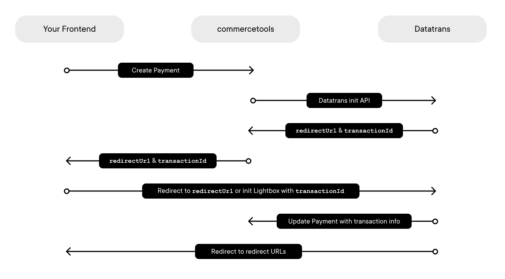
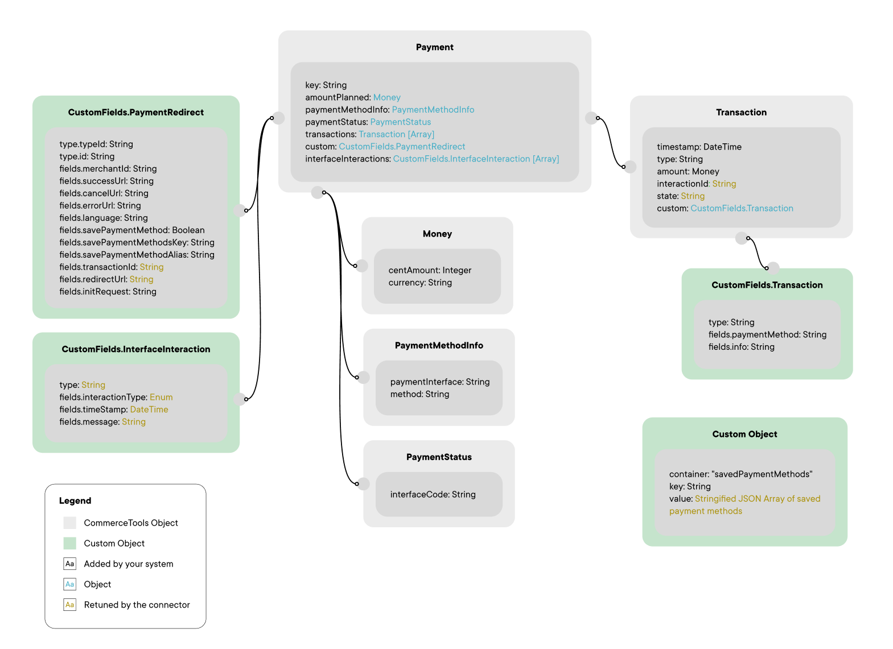

# Integration Guide - Commercetools Connector for Planet

The guide below outlines the steps you need to take to complete the integration to Planet via the Datatrans payment gateway. Please read the [introduction page](https://github.com/weareplanet/commercetools-planet-integration) first and understand the concept and the existing features before proceeding with the integration.

## Overview

The integration guide consists of the following sections:

* How it all works [ [jump to section](#how-it-all-works) ]
* Setting up Datatrans [ [jump to section](#datatrans-setup) ]
* Setting up commercetools [ [jump to section](#commercetools-setup) ]
* Setting up your environment [ [jump to section](#environment-setup) ]
* Configuring the connector [ [jump to section](#connector-configuration) ]
* Initiating payments [ [jump to section](#initiating-payments) ]
* Frontend integration [ [jump to section](#frontend-integration) ]
* Testing, because we all love it [ [jump to section](#testing) ]

## How It All Works

The connector consists of a commercetools API extension and hosted lambda functions interacting with Datatrans. Your frontend will solely communicate with Datatrans by writing and reading from/to commercetools objects. Commercetools provides some of the objects the connector requires by default. On top of that, you will submit custom objects and fields we introduced to support our flows.

When data is passed in these objects, our API extension intercepts the data and calls the relevant Datatrans APIs. In addition, synchronous and asynchronous response data is received by the connector and written to commercetools objects to be consumed by your frontend. Below is an overview of what the data flow will look like.



We support the most common payment flows out-of-the-box. We use sensible default values for starting and working with transactions. If you need to process additional flows, you may read the [Datatrans documentation](https://docs.datatrans.ch) and specifically [Redirect & Lightbox integration](https://docs.datatrans.ch/docs/redirect-lightbox) to understand what is possible via the gateway and use low-level options to customize the connector to your liking. For most use cases, however, you will not need to implement this.

## Datatrans Setup

The following items are required:

* An active Datatrans account (a productive or sandbox account)
* An active merchantId
* Payment methods configured and ready to be used
* Your basic authentication password
* Your sign key

### Retrieving your Basic Auth Credentials and Your Sign Key

Your basic authentication credentials and a sign key will be required for the connector to communicate properly with Datatrans. Make sure these variables are set correctly in your [environment variables](environment-setup-guide.md#environment-variables).

You will find the basic authentication credentials in your merchant configuration. Login to your Datatrans merchant account and navigate to the merchant view first by clicking the merchant view selector on the top right. Given you have sufficient access rights, you should see a tab called `UPP Administration`. Navigate next to `Security ➝ Server-to-Server services security` and toggle the checkbox to activate the additional security, if not already done. Your username (Datatrans `merchantId`) and basic auth password are now displayed on this screen.

You will also find the sign key (HMAC) in your merchant configuration. Navigate to `Security ➝ Security Signature` and choose the option to sign your requests with HMAC-SHA256 dynamically. Activate `sign2` and generate a sign key for both. Datatrans will use this key (`sign2`) to sign the webhook payload.

## Commercetools Setup

To use the connector, you will need a valid commercetools account. You can use a free trial account or a paid account. For simplicity's sake, we assume you will already have a commercetools project. To allow a connection from the connector to commercetools, you will need to configure an API client, some custom types, and an API extension.

### API Client

A commercetools API client has a `client_id`, `secret`, `API URL`, and `Auth URL`, which you will need to enable the communication between the connector and commercetools. You can refer to commercetools' explanation [here](https://docs.commercetools.com/merchant-center/api-clients). You will also need to know your commercetools' `projectKey`, the project's name. The API client needs manage & view permissions for various commercetools objects, including `Payments`, `Types`, and `Extensions`. To set the right permissions for the connector's API client, use the commercetools UI and select `Admin client` from the scopes preset dropdown. You need to define these credentials during your [environment setup](#environment-setup).

### Custom Types

Custom types will have to be created in your commercetools environment to submit data required by the Datatrans gateway and store response data. Below is an overview of the various custom types you must create in commercetools. It shows how data will be expected as input and returned by the connector. The custom types will be created when [setting up your environment](environment-setup-guide.md).



### API Extension

Finally, to create various calls to Datatrans, you will need an API extension. The API extension will be created when [setting up your environment](environment-setup-guide.md).

## Environment Setup

To deploy the connector, you will need access to an on-premise environment or a cloud setup running Node, e.g., Amazon Web Services (AWS). Please read the detailed [guide for the environment setup](environment-setup-guide.md). The connector requires Node.js 16 to work.

## Connector Configuration

The connector's configuration is done via environment variables. This is also where you set the commercetools API client credentials and Datatrans merchant credentials. You can read more on it [here](environment-setup-guide.md#environment-variables).

## Initiating Payments

Call commercetools' `Create a Payment` API to initiate a new payment. Within this API, you need to submit our custom fields as `custom.fields.*` of type `pp-datatrans-redirect-payment-type` to store and process data required by Datatrans.

Below is what your `PaymentDraft` could look like.

```json
{
    "key": "my-reference-1234",
    "amountPlanned": {
        "centAmount": 100,
        "currencyCode": "EUR"
    },
    "paymentMethodInfo": {
        "paymentInterface": "pp-datatrans-redirect-integration",
        "method": "ECA"
    },
    "custom": {
        "type": {
            "typeId": "type",
            "id": "{commercetoolsTypeId}"
        },
        "fields": {
            "merchantId": "1110001337",
            "successUrl": "{shopUrl}/purchase/1234?s=success",
            "errorUrl": "{shopUrl}/checkout?s=error",
            "cancelUrl": "{shopUrl}/checkout?s=cancel"
        }
    }
}
```

The attributes that can be sent to the Create a Payment API as a `PaymentDraft` are outlined below.

Commercetools Payment Attribute | Required | Format | Description
:---------|:---------|:---------|:---------
`key` | Yes | String, 1-20 chars | The reference you want to use for your transaction.
`amountPlanned.centAmount` | Yes | Integer | The amount in cents for your transaction. It needs to be 0 to create a dedicated registration.
`amountPlanned.currencyCode` | Yes | String, 3-letter ISO-4217 | The currency for your transaction.
`paymentMethodInfo.method` | Yes | String | A string containing one or multiple payment methods. Submit only one method to skip the payment method selection and start with the specified method directly. For Google Pay and Apple Pay, you need to specify at least one card type in here (eg. `"ECA, VIS, PAY"`).
`custom.type.typeId` | Yes | String | The `typeId` is the subtype of your custom type. This should be set to `type`.
`custom.type.id` | Yes | String | The id of your type. This is created after you added your custom types to your commercetools project.
`custom.fields.merchantId` | Yes | String | The merchantId you want to assign your transaction to. This merchantId has to be configured in your [environment variables](environment-setup-guide.md#environment-variables).
`custom.fields.successUrl` | Yes | String | The URL you want users to be redirected to if the transaction result is `success`.
`custom.fields.cancelUrl` | Yes | String | The URL you want users to be redirected to if the transaction result is `cancel`.
`custom.fields.errorUrl` | Yes | String | The URL you want users to be redirected to if the transaction result is `error`.
`custom.fields.language` | No | String, 2-chars ISO-639-1 | The language you want to display on the Redirect & Lightbox integration. The supported languages are displayed [here](https://docs.datatrans.ch/docs/redirect-lightbox#language-support).
`custom.fields.savePaymentMethod` | No | Boolean | If enabled, the connector will store the user's payment method (alias) for future payments in custom type `savedPaymentMethods`. You must use this in pair with `savedPaymentMethodsKey`.
`custom.fields.savePaymentMethodsKey` | No | String | Use this attribute to specify the key under which a user's saved payment methods are stored in the custom type `savedPaymentMethods`. Use a user's login or a unique Id as the key.
`custom.fields.savedPaymentMethodAlias` | No | String | Set this value for using a previously saved payment method. The value must match a specific alias in the custom object `savedPaymentMethods`, key `savedPaymentMethodsKey`.
`custom.fields.initRequest` | No | String | Used to define advanced flows not covered by the connector yet. You should use this with caution, and you may want to get in touch with us before using this.

Below are the additional payment attributes in `Payment`, returned by the connector after the Payment object has been created.

Commercetools Payment Attribute | Format | Description
:---------|:---------|:---------
`custom.fields.transactionId` | String | The `transactionId` by Datatrans.
`custom.fields.redirectUrl` | String | The `redirectUrl` where you should redirect your user to proceed with their transaction.

### Redirect & Lightbox init Request

The connector passes the provided payment attributes to Datatrans's [init endpoint](https://api-reference.datatrans.ch/#operation/init). Read `custom.fields.redirectUrl` and redirect the user's browser to that URL to reach the Datatrans' payment page and proceed with the transaction. If you use the Lightbox integration, you must follow the steps outlined in the Datatrans documentation page for [Redirect & Lightbox](https://docs.datatrans.ch/docs/redirect-lightbox#lightbox-integration), together with the `transactionId`.

The connector currently automatically settles transactions (aka auto-settle, auto-capture). Check the table below to understand the mapping from commercetools' payment attributes to the Datatrans API.

Datatrans Parameter | Commercetools Payment Attribute
:---------|:----------
 `refno` | `key`
 `amount` | `amountPlanned.centAmount`
 `currency` | `amountPlanned.currencyCode`
 `paymentMethods` | `paymentMethodInfo.method`
 `language` | `custom.fields.language`
 `option.createAlias` | `custom.fields.savePaymentMethod`
 `redirect.successUrl` | `custom.fields.successUrl`
 `redirect.cancelUrl` | `custom.fields.cancelUrl`
 `redirect.errorUrl` | `custom.fields.errorUrl`

### Tokenization

Saving card details for future payments is possible via the connector. If you set the custom field `savePaymentMethod` to `true` during your payment request, the connector will retrieve a token (alias) from Datatrans and store it in `savedPaymentMethods`. You will also have to specify a key under which it should be stored (`savedPaymentMethodsKey`). Use the user's username or another unique identifier for this. Please note that the connector only supports tokenization for cards.

```json
{
    ...
    "custom": {
        ...
        "fields": {
            ...
            "savePaymentMethod": true,
            "savedPaymentMethodsKey": "userId-1234",
        }
    }
}
```

If you want to submit a token in your request to process further customer-initiated-payments (aka fast checkout, one-click checkouts), you can do so by specifying `savedPaymentMethodsKey`, the key referring to the `savedPaymentMethods` entry in which the user's payment methods are stored, and `savedPaymentMethodAlias`, a specific alias listed in that object.

Please note that your frontend will have to read the object to get the alias values. Typically, your frontend would display a list of all saved methods for the user to choose. The selected saved payment method (alias) would then be set as a custom field when the payment is initiated.

```json
{
    ...
    "custom": {
        ...
        "fields": {
            ...
            "savedPaymentMethodsKey": "userId-1234",
            "savedPaymentMethodsAlias": "{alias}"
        }
    }
}
```

Below is what the custom object `savedPaymentMethods` could look like.

```json
{
    "key": "userId-1234",
    "container": "savedPaymentMethods",
    "value": {
        {
            "paymentMethod": "ECA",
            "card": {
                "alias": "{alias}",
                "masked": "424242xxxxxx4242",
                "fingerprint": "{fingerprint}",
                ...
            }
        },
        ...
    }
}
```

### Choosing the Payment Methods to Display

You can submit one or more payment methods in `paymentMethodInfo.method`. If you submit only one payment method (e.g., `"ECA"`), the gateway will automatically show the final payment screen for that given payment method. If you submit more than one (e.g., `"ECA, VIS, PAP, PAY"`), we will display a payment method selection, where the consumer can select their payment method on our payment form. We recommend doing this pre-selection on your frontend whenever possible. For Apple Pay and Google Pay, you will need to specify at least one card supported by Apple Pay or Google Pay to render the payment page correctly. Apple Pay is currently only supported by the Redirect integration. It will only be rendered if the device accessing the payment page has Apple Pay configured correctly and the browser in use is Safari.

```json
{
    ...
    "paymentMethodInfo": {
        ...
        "method": "ECA, VIS, TWI, PAP, PAY, APL, ... "
    },
    ...
}
```

### Payment Notification (Webhook)

No additional configuration is necessary for receiving asynchronous callbacks from Datatrans when the payment state changes. The connector stores the received information from Datatrans in commercetools' objects. The data is available as soon as the user's browser is redirected to one of the redirect pages (success, error, or cancel).

### Custom Init for Advanced Flows

You can also submit a custom init payload that may be required for advanced flows only. You can submit this by using the custom field `initRequest`. Please get in touch if you need an advanced flow to ensure you implement this flow correctly.

```json
{
    ...
    "custom": {
        ...
        "fields": {
            ...
            "initRequest": "Serialized JSON expected by Datatrans's init endpoint goes here"
        }
    }
}
```

### Logs Related to the Connector

The connector automatically logs every request to & from Datatrans into the custom type `Payment.interfaceInteractions`.

If you use our AWS deploy script, you can monitor the logs within the Lambda function. Simply access the `Logs Insights` section in AWS and search for specific `paymentKeys` (or `correlationIds`):

```sql
fields @timestamp, message, payload.traceContext.correlationId as correlationId, payload.traceContext.paymentKey as paymentKey
| sort @timestamp desc
| filter payload.traceContext.paymentKey like "{paymentKey}"
```

## Frontend Integration

There are currently no frontend integrations officially supported. If you want us to add official support for one of your desired frontend frameworks, you may [get in touch](https://www.datatrans.ch/contact) with us.

The response from your requests to the Create a Payment API will contain a `redirectUrl` and a `transactionId` which you can use to have the consumer's client reach the payment page. If you use the Lightbox integration, you must follow the steps outlined in the Datatrans documentation page for [Redirect & Lightbox](https://docs.datatrans.ch/docs/redirect-lightbox#lightbox-integration).

We recommend doing the pre-selection of the payment method by the customer on your frontend.

## Testing

To test your integration and specific flows, you can use various test cards and credentials, available on our dedicated page [testing credentials](https://docs.datatrans.ch/docs/testing-credentials). We also recommend running productive tests before going live with your project.

## Support

Should you need support during the integration, you may [contact us](https://www.datatrans.ch/contact) anytime. We'll get back to you asap.
